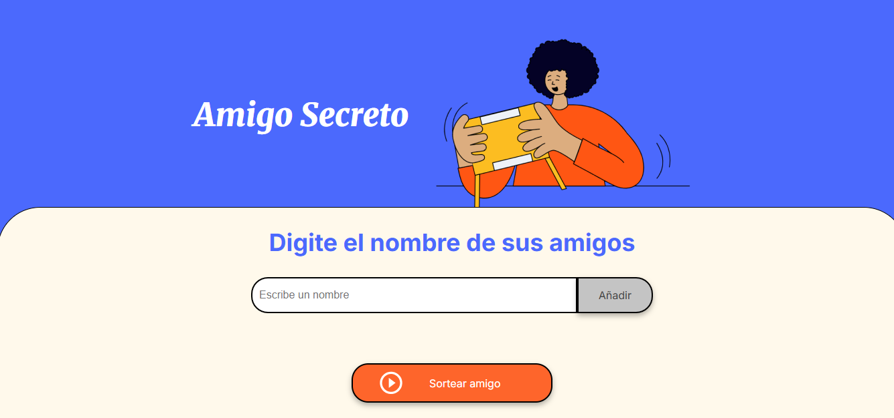
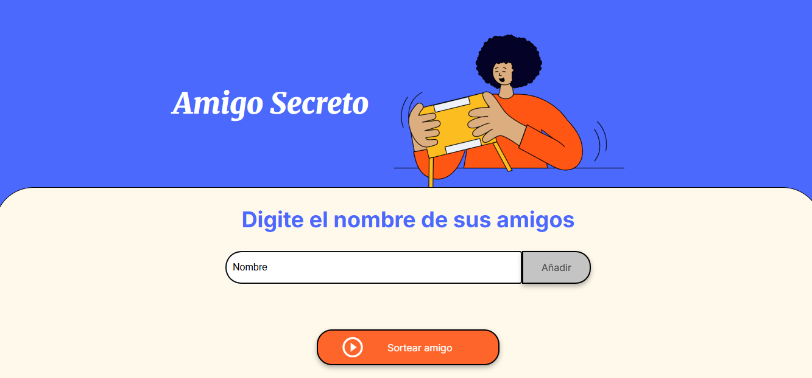
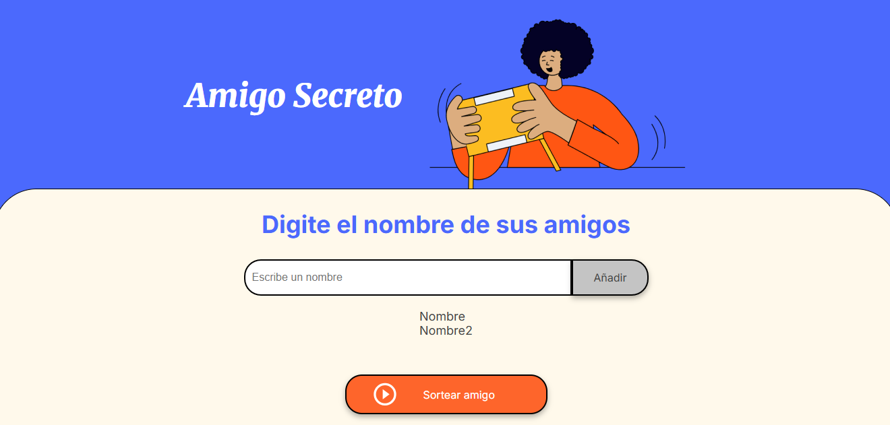
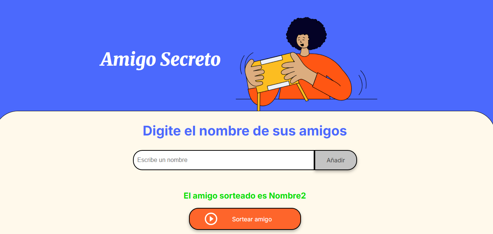

# Amigo Secreto

Este proyecto es una aplicación web sencilla para organizar un sorteo de "Amigo Secreto" entre un grupo de personas. Permite agregar nombres, visualizar la lista de participantes y realizar sorteos aleatorios entre los nombres ingresados.

## Funcionalidades

- **Agregar participantes:** Ingresa nombres únicos a la lista de amigos.
- **Visualizar lista:** Muestra en pantalla todos los nombres agregados.
- **Sorteo aleatorio:** Selecciona un amigo al azar de la lista de participantes.
- **Validaciones:**
  - No permite nombres vacíos.
  - No permite nombres repetidos.
  - Solicita al usuario agregar al menos dos nombres para realizar el sorteo.

## Instalación y uso

1. **Clona el repositorio:**
   ```bash
   git clone https://github.com/Leandro-Avalos/Challenge-Amigo-Secreto.git
   ```
2. **Abre la carpeta del proyecto:**
   Puedes abrirla en tu editor de preferencia o simplemente hacer doble clic en `index.html` para abrir la app en tu navegador.

3. **No requiere instalación de dependencias** (solo archivos HTML, CSS y JS).

## Cómo funciona

1. Escribe el nombre de un participante y haz clic en "Añadir".
2. Repite el proceso hasta tener al menos dos nombres.
3. Haz clic en "Sortear amigo" para seleccionar un amigo al azar.
4. El nombre sorteado aparecerá en pantalla.

## Capturas de pantalla
1. **PANTALLA DE INICIO**

2. **INGRESANDO UN NOMBRE**

3. **JUEGO CON DOS NOMBRES YA INGRESADOS**

4. **PANTALLA LUEGO DE REALIZAR EL SORTEO**

## Posibles problemas y soluciones

- **No se agregan nombres:** Asegúrate de no dejar el campo vacío y de no repetir nombres.
- **No se puede sortear:** Debes agregar al menos dos nombres antes de sortear.

## Estructura del proyecto

- `index.html`: Estructura principal de la aplicación.
- `style.css`: Estilos visuales.
- `app.js`: Lógica de la aplicación.
- `assets/`: Carpeta para imágenes y recursos.

